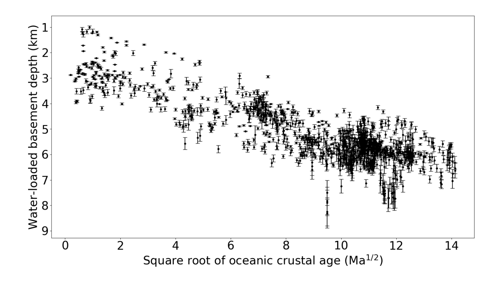
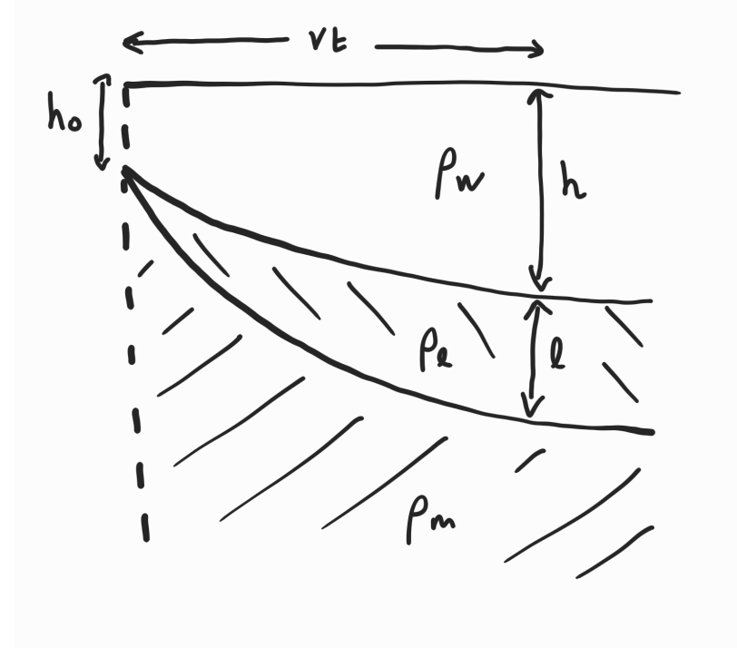
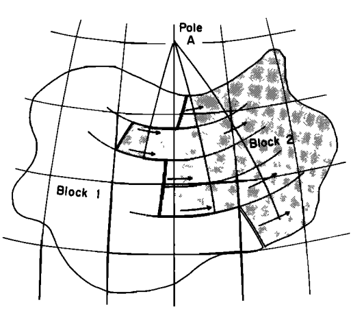
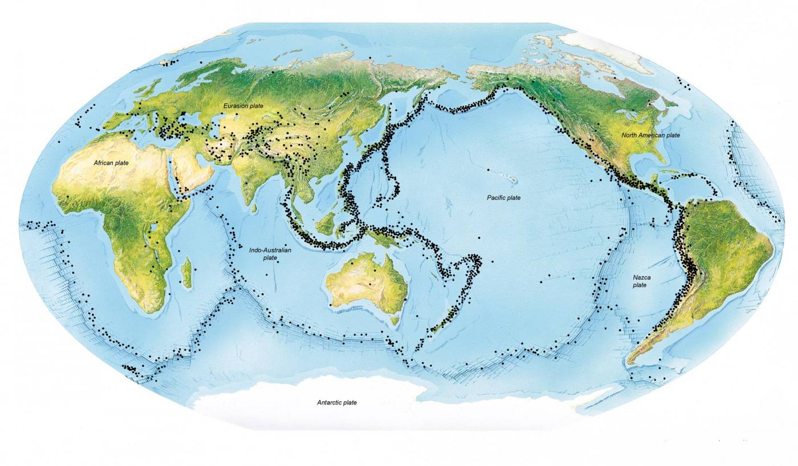

(lecture_1)=
# Plate tectonics

**Key Concepts:**
- Early observational evidence for continental drift and sea floor spreading. 
- Age versus depth model for the oceaninc lithosphere. 
- Plate tectonics as a kinematic theory along with the 
supporting observations. The theory works well in the oceans, 
but only to a limited extend in the continents. 
- Plate motions do not relate directly to the flow of the mantle 
below. 
- The reason that plate-like behaviour emerges on the Earth 
is not fully understood, and cannot be self-consistently modelled. 
- The key concept that remains to be fully understood is
the rheological behaviour of the lithosphere, and it is likely that subtle rheological effects account for the differing behaviours
seen on the Earth, Venus, and Mars.

## Continental drift

**Plate tectonics** is often conflated with **continental drift**. 
The latter idea that the continents, somehow, move with respect to one another is principally associated with Alfred Wegner (1880-1930). Early evidence was largely geological, with people observing similarities
in geological structures, rocks, and fossils between different continents.  No plausible physical mechanism was proposed,
with geologists evoking fantastical mechanisms without 
any understanding or care for known physics. It is relevant that an understanding of the solid-state creep mechanisms that allow 
the mantle to flow over geological time  first emerged within materials science in the mid 20th century. Until these ideas were in place,  the known forces acting on the Earth were vastly insufficient 
to account for large scale motion of the continents. Nevertheless, this remains,  with, perhaps, some justification, an area in which geologists like to think they outsmarted  arrogant geophysicists.

## Sea floor spreading 

A key step towards plate tectonic theory was the **sea floor 
spreading hypothesis**  due to  Harry Hess (1906-1969)
and Robert Dietz (1914-1995) in the USA. This is the idea that 
new ocean floor is produced in central ocean ridges
and then spreads laterally, pushing the contients aside as it does so.
Looking at a  map of ocean bathymetry where we can see clear ocean ridges (Fig.1), this may seem obvious, but detailed maps of the ocean floor were only gradually becoming available following the second world war.

```{figure} figures/topo.gif
---
name: fig:02top
---
Earth surface topography and bathymetry. Within the oceans clear
ridge like structures can be seen. Figure taken from https://topex.ucsd.edu/marine_topo/text/topo.html
```

The first conclusive evidence for sea floor spreading was provided through the 
work of Fred Vine (1939-2024), Drum Matthews (1931-1997) in the UK, 
and Lawrence Morley (1920-2013) in Canada. This idea depends on the observation 
that the polarity of the Earth's magnetic field undergoes episodic reversals.
These magnetic reversals can be recorded within certain types of rock (e.g., 
basaltic ocean floor which is comparatively rich in magntic minerals), and
their **remnant magentism** can be measured. Careful study 
of such magnetic rocks coupled with radiometric dating of 
allowed for a detailed geomagnetic time-scale
to be built back for hundreds of millions of years into the past. 

Within the ocean basins,  remnant magnetism could be measured from ships, and variations with position were progressively mapped out. As this was being done, a striking observation emerged. In sections transverse to ridge axes, 
a symmetric pattern of reversals could be seen on either side. 
These observations were clearly consistent with sea floor spreading
from the ocean ridges, and, moreover, provided a quantitiative means 
for dating the age of the ocean floor, and hence for quantifying the 
spreading rates.


```{figure} figures/vine_matthews.png
---
name: fig:02vine_matthews
---
Three magnetic profiles transverse to ocean ridges
from the original paper by Vine and Matthews (1963).
In each case, the ridge axis is in the centre of the profile, 
and on either side a symmetric pattern of reversals can be seen. 
Subsequenct observations covering the entirety of the ocean 
basins  confirmed the initial observations beyond any doubt.
```

## Age versus depth within the oceans

Before turning to the development of plate tectonics, it will be useful
to consider the relation between bathymetry and age  within the ocean basins. As we have seen, magnetic reversals in the 
oceans provides a simple means for determining the age as
a function of position on the sea floor. Such a plot 
is shown within Fig.3, though note that the depth 
is plotted as a function of the square root of age. 
There is  significant scatter, linked principally to dynamic topography, but an  overall linear trend can be seen, with the depth 
systematically increasing with age. 



*Fig 3. A plot of water depth versus the square root of age 
from observations across the ocean basins.  Data taken 
from Richards et al. (2018).*

A quantitative explanation for the observed behaviour can be provided
at various levels of sophistication. Here we will  apply a simple
scaling argument along with an **isostatic balance**. This result
is interesting in of itself, but it will also help us 
later understand one of the principle forces that drives plate motion. 

Recall from the last lecture that the lithosphere comprises the 
crust and upper part of the mantle that are cool enough to behave 
elastically over geological time. As a result, heat transfer within 
the lithosphere is dominantly through conduction. We also showed last time
that the time-scale for conductive cooling over a length-scale
$l$ is given by
```{math}
t \sim \frac{l^{2}}{\kappa}, 
```
with $\kappa$ the thermal diffusivity. 

At a mid ocean ridge new oceanic lithosphere is produced. This hot material then spreads laterally, and as it does so it cools,
becomes more dense, and  subsides. This is the basic mechanism that 
explains the observed age-depth relation. To quantify this, 
we assume that the lithosphere initially has the 
same temperature as the underlying mantle, and hence the 
same density, $\rho_{m}$. Over a time, $t$, this material 
will have moved laterally to a distance $v t$ from the
ridge, with $v$ the spreading speed. In this time, 
a thickness, $l \sim \sqrt{\kappa t}$, of the lithosphere
will have cooled to a lower density, $\rho_{l} = 
\alpha (T_{m} - T_{l}) \rho_{m}$ with $\alpha$
the thermal expansivity and $T_{l}$ the lithospheric
temperature.
This situation is summarised graphically in Fig.4.
Note that a more sophisticated treatment would 
solve the heat conduction equation to 
determine the variation of temperature, and 
hence density with depth. 



*Fig 4. The geometry for our simplified model for the 
cooling and subsidence of the oceanic lithosphere.*

To determine the subsidence associated with the cooling
of the lithosphere, we apply an isostatic balance. This
is the idea that at a certain **compensation depth** within the mantle
the  pressure within each vertical column should be equal. 
Assuming that the acceleration due to gravity does not vary
significantly, equality of pressure is the same as 
the balance of mass per unit area, and hence we are led to the 
```{math}
\rho_{w} h_{0} + \rho_{m}(h+l) = \rho_{w} h + \rho_{l} l, 
```
where $\rho_{w}$ is the density of water, and  $h_{0}$ the 
water depth at the ridge. Solving for $h$, 
we find
```{math}
h = h_{0} + \frac{\rho_{l}-\rho_{m}}{\rho_{m}-\rho_{w}}l, 
```
and hence we arrive at
```{math}
h = h_{0} + \frac{\alpha (T_{m}-T_{l})\rho_{m} \sqrt{\kappa t}}{\rho_{m}-\rho_{w}}, 
```
where we can see the square-root of time dependence. 

The model just described predicts that the lithosphere gets 
thicker and thicker as it ages. In reality, the underlying mantle acts 
as a heat source. This places an upper bound on the
lithospheric thickness, and the  and 
the ocean floor is found to level off at large  ages (greater than around 80 Ma).

## Plate kinematics

Plate tectonics views the surface of the Earth as being split into a relatively small number of rigid plates that undergo relative motion. 
In particular, the deformation necessary to accommodate this motion 
is limited to thin regions around the plate boundaries. Importaly, plate tectonics is a kinematic theory that explains the manner in which 
these plates must move, but it does not explain *why* they move. 

It is worth remembering that the question of whether or not a planet has plate tectonics is asking whether a specific kinematic model  is relevant to understanding its behaviour. Indeed, plate tectonics arose in the late 1960s, and by the 1970s it was clear that this theory is only really applicable within the oceans. The behaviour of
the continents is significantly more complicated, with 
broad regions of diffuse deformation seen within their interiors. 
This led to the development of various theories for **continental 
tectonics**, though there is not time to discuss any of them.



*Fig 5. A figure from Morgan (1968) showing 
graphically the constraint that the relative motions of 
 rigid plates (or blocks in his terminology) on the Earth's 
 surface can be described by rotation about a axis
 through the Earth's centre (represented by a pole 
 on the surface).*


 The central idea of plate tectonics is that the plates are rigid, 
 which is to say that they do not undergo appreicable internal deformation.  We can view each plate as an irregularly shaped
 spherical cap on the Earth's surface. It is a result of geometry that the only possible motion of 
 such a rigid spherical cap is a rotation about the Earth's centre. Thus, at an instance in time, the kinematic description of 
 plate motion is reduced to specifying a set of rotation axes and 
 mangitudes.  Using this geometric insight,  McKenzie and Parker (1967)  and Morgan (1968) independently showed that observed surface motions (inferred from a range of proxies) were consistent with 
 the plate tectonic model.


*Fig 4. An early quantitative test of the plate tectonics
 from Morgan (1968). If the relative motion 
across the mid Antlantic ridge is described by 
a rotation, then there should be a systematic 
variation of spreading rate with distance from the 
rotation pole. Here the predictions for a best
fitting rotation polar the magntiude are 
compared with spreading rates inferred from 
using magnetic anomalies.*

## Earthquakes and Subduction zones

Within the early history of plate tectonics, a prominent 
role was played by **earthquake seismology**. This is 
firstly because earthquakes occur at plate boundaries
in response to their relative motion, and hence 
earthquake locations can be used to delineate plate 
boundaries. A modern example of such a map is 
shown in Fig.5. As with the earlier plot of 
ocean bathymetry, when looking at such a figure it 
is hard not to think the reality of plate tectonics is
entirely obvious, but global maps of seismicity were 
only just emerging when plate tectonic theory was developed. 



*Fig 6. A map of global earthquake distribution and their relation 
to the tectonic plates. Within the oceans, earthquakes are seen 
to sharply delineate the plate boundaries, but this 
simple correspondence breaks down in continental regions 
such as the Himalyas. Taken from https://www.bgs.ac.uk/discovering-geology/earth-hazards/earthquakes/where-do-earthquakes-occur/.*


As well as locations, seismological methods also provide information 
on the sense of relative motion that caused an earthquake. 
There is not time to discuss how this method works, but the 
directions provided were  data for testing plate tectonic
theory, and hence for determining rotation poles for the different 
tectonic plates. 

A particularly important example of this is in the 
study of **subduction zones**. More will be said about subduction 
zones later in the course, considering in particular their 
role in volcanism and in chemical cycles between the 
Earth's surface and mantle. For the moment, we can think of them 
simplistically as areas, generally at the margins of 
ocean basins where the oceanic lithosphere has cooled sufficiently to 
become unstable and sink into the convecting mantle below.  The 
path of these subducted slabs into the mantle is delineated by 
earthquakes, with the inferred senses of motions  being consistent 
with our interpretation.


*Fig 7. Cross sections of earthquake locations along sections 
transverse to the subduction zone under Central America. The 
motion of the subducted slab is westward under the continent, and 
here we see its path into the mantle delineated by the 
increasing depth of the earthquakes while moving east to west. 
From Molnar & Sykes (1969).*


## Plate dynamics

We have now summarised the observational evidence that 
led people to accept plate tectonics as a kinematic theory 
that well describes the relative motions seen within ocean regions
and some continental ones. But what causes this surface 
motion, and how does it relate to convection in the mantle
below? 

The first thing to say is that plate motions do not 
simple reflect convective motions in the mantle. 
Such a simplistic view is commonly shown in 
textbook cartoons, but observations show clearly 
that things are more complicated. For example, 
there are locations at the margins of the Pacific  were
mid ocean ridges are being actively subducted!
It is for this reason that the speed at which 
plates move cannot be straightforwardly 
identified with the speed of the convecting 
mantle, though their orders of magnitudes are 
still expected to be similar. 

There are thought to be three principle mechanisms that 
drive oceanic plates. In each case, simple quantitiative 
models can be developed, but we will just sumarise the 
basic ideas. 

First, there is **ridge push**. This is the force linked to the 
lateral pressure gradient that exists between the ridge axis 
and older sea floor that has cooled and subsided. The 
existence of such a force can be readily 
understood by looking back to Fig.4. 

The next force is known as **slab pull**. This is the negative 
buoyancy force transmitted from a subducted part of the slab
to the rest of the plate. 

Finally, there is **viscous drag**, this  being the
horizontal force applied to the base of the lithosphere 
by the flow of the underlying mantle. 

The relative importance of these different forces can be assessed 
using a range of methods and observations. For example, if
slab pull is important, we would expect the typical speed of 
plates to increase as a function of their boundary being subducted, 
and this is indeed seems to be the case.  

The key point for us to understand is that while the
motion of the plates does, ultimately, result from the 
convection in the mantle, the precise relation 
between these processes is complicated, with plate 
speeds and directions not providing a direct view of the 
underlying mantle flow. 

## Is plate tectonics an inevitable consequence of mantle convection? 

No. This is shown clearly by looking at Mars and Venus. 
Both planets are of a similar size and age to the Earth, 
and it is certain that their mantles are undergoing active convection. 
But neither has plate tectonics. On Mars there are a few surface features that resemble those produced by plate tectonics, and it is possible that in the past its behaviour was more similar to the Earth. Vensus, on the other hand, seems to be entirely different from the Earth, with no sign of tectonic plates. 

The big question are, therefore, why the Earth has plate tectonics,
why other similar planets do not, and what range of tectonic behaviours might arise. This is a difficult questions that can only be partially answered. At present, it is not even possible to self-consistently model 
and understand plate tectonics on the Earth. This is not an issue of the basic physics, but of the appropriate rheology for the Earth's mantle and lithosphere.  We have seen that within the lithosphere
deformation is strongly localised to  regions along plate boundaries. Within complicated numerical simulations, it has been possible to replicate this plate like behaviour, but only by "hard coding" 
weak areas along the plate boundaries. 

The precise mechanisms by which plate boundaries form is largely unknown. There are certainly good ideas, but none are 
yet conclusive. One interesting idea is that of a **damage rheology**, with lithospheric material being gradually weakened as it is deformed through processes such as grain size reduction (e.g., Bercovici & Ricard 2014). Areas that have been weakened undergo greater deformation
in response to forcing, and hence tend to weaken further. This provides a feedback mechanism by which  deformation can localise within narrow regions. 

Rheological differences are, presumably, the factor that leads to different behaviour between the Earth and similar planets such as
Mars and Venus. Here seemingly subtle points could be very important. 
For example, the Earth has surface water, with this water cycled through
 the mantle through ocean ridges and subduction. A small amount of 
 water, in the form of hydrous minerals, within mantle material 
 is known from experiments to have a substantial effect on 
 their rheological behaviour. It is possible that Venus 
 does not have plate tectonics because it lost its surface 
 water early in its history, and as a result, its lithosphere
 is too strong to break into plates. 

Clearly these are not settled matters. From the perspective of a planetary scientist musing about the interior dynamics exoplanet
it is, however, important to know and remember that the behaviour of the 
Earth's mantle is not fully understood and cannot be self-consistently modelled. This should serve as  a note of caution for to those inclined to run complicated numerical convection codes within a new parameter 
regime  in the hope of learning something new. 


## Further reading

- Turcotte, D.L. and Schubert, G., 2002. Geodynamics. Cambridge university press.


## References

- Bercovici, D. and Ricard, Y., 2014. Plate tectonics, damage and inheritance. Nature, 508(7497), pp.513-516.

- McKenzie, D.P. and Parker, R.L., 1967. The North Pacific: an example of tectonics on a sphere. Nature, 216(5122), pp.1276-1280.

- Molnar, P. and Sykes, L.R., 1969. Tectonics of the Caribbean and Middle America regions from focal mechanisms and seismicity. Geological Society of America Bulletin, 80(9), pp.1639-1684.

- Morgan, W.J., 1968. Rises, trenches, great faults, and crustal blocks. Journal of Geophysical Research, 73(6), pp.1959-1982.

- Richards, F., Hoggard, M., Crosby, A., Ghelichkhan, S. and White, N., 2020. Structure and dynamics of the oceanic lithosphere-asthenosphere system. Physics of the Earth and Planetary Interiors, 309, p.106559.

- Vine, F.J. and Matthews, D.H., 1963. Magnetic anomalies over oceanic ridges. Nature Publishing.

$$\newcommand{\ee}{\mathrm{e}}\newcommand{\ii}{\mathrm{i}}\newcommand{\ddns}{\,\mathrm{d}}$$